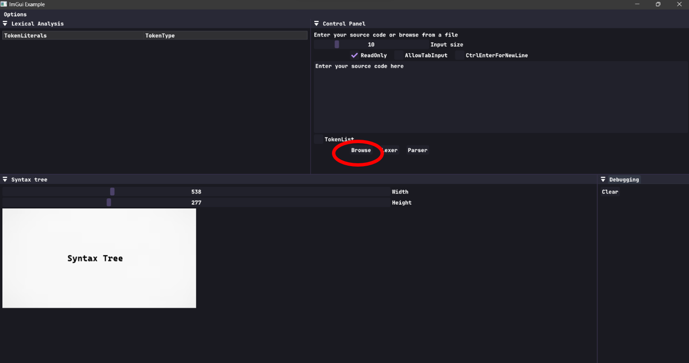
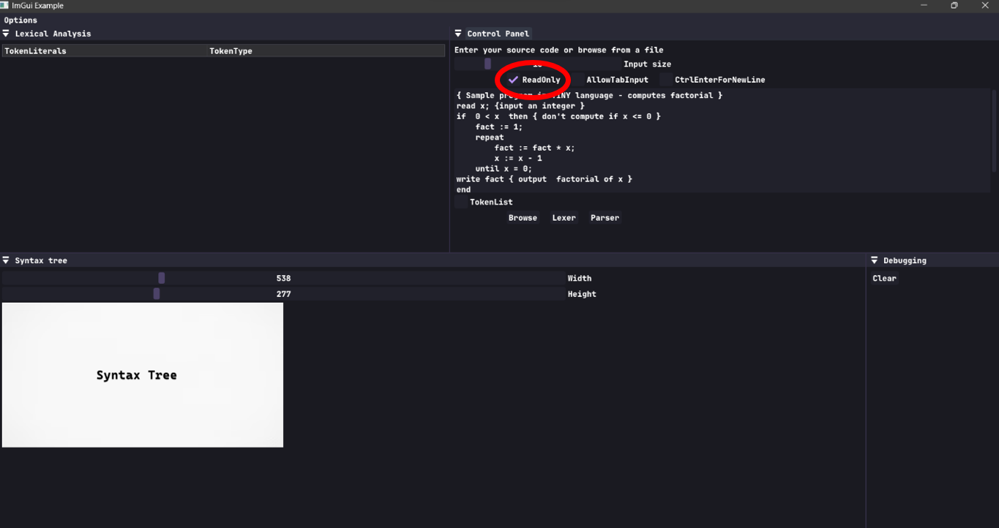
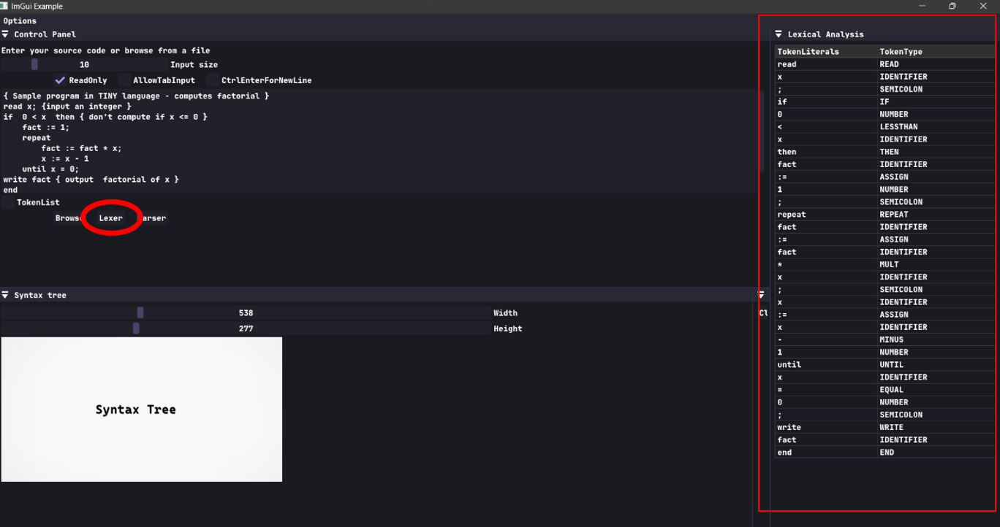
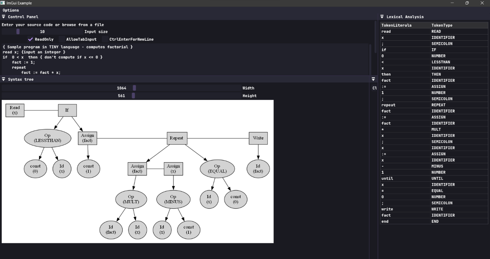
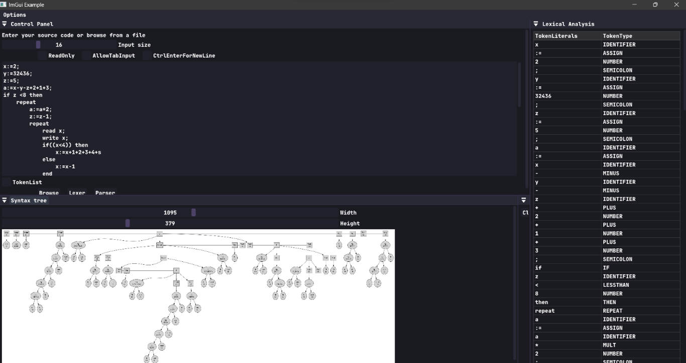

# TINY Language Scanner and Parser
- In TINY, a program follows a straightforward structure: it's a sequence of statements separated by semicolons. 
- There are no complex procedures or declarations. 
- All variables are integers and are declared by assigning values to them directly. 
- The program only has two control statements: if and repeat. These control statements can contain sequences of other statements. An if-statement can include an optional else part and must end with the keyword "end". 
- TINY also has read and write statements for input and output operations. 
- Comments are allowed within curly brackets but cannot be nested. 
- Expressions in TINY are limited to Boolean and integer arithmetic expressions. A Boolean expression compares two arithmetic expressions using the < and = operators. Arithmetic expressions can include integer constants, variables, parentheses, and basic arithmetic operators (+, -, *, and / for integer division). Boolean expressions are only used as tests in control statements; there are no Boolean variables, assignments, or I/O operations.

 
## Usage
1. Compile using either the `Makefile` or included batch file `run.bat`
2. Open `GUI.exe`
3. Browse your code 

  

- Note: If you want to write your code in GUI uncheck ReadOnly

  

  

4. Press on parser to draw Syntax Tree

  

  

